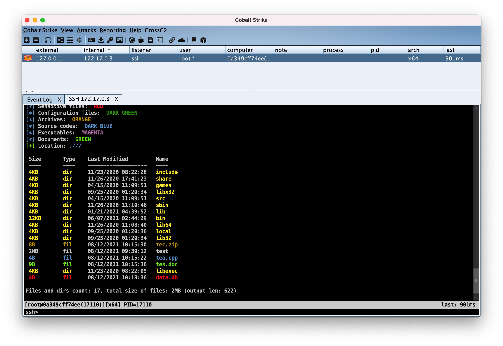
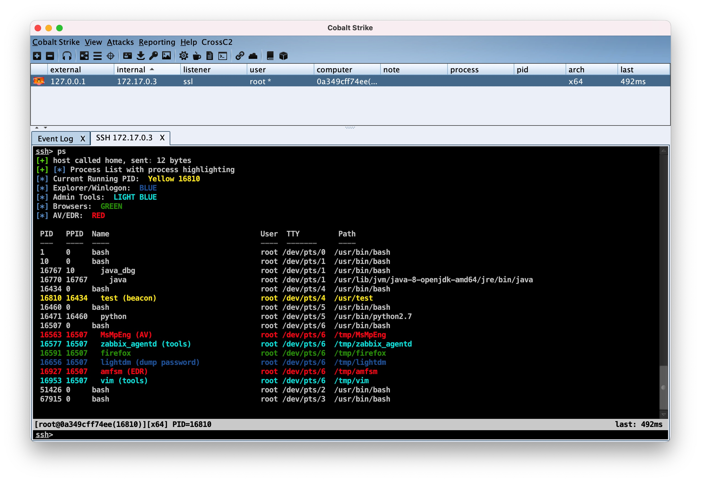

# CrossC2 Kit

[README](README.md) | [中文文档](README_zh.md)

- **`cc2FilesColor.cna`** - 支持CrossC2会话的彩色显示文件列表。 基于 [@mgeeky](https://github.com/mgeeky/cobalt-arsenal/blob/master/FilesColor.cna) 的`FilesColor.cn`，该脚本根据文件类型和扩展名对文件列表输出进行着色，例如标注office文档或源码、数据库文件等。
  
  使用`ls`命令进行显示:

- **`cc2ProcessColor.cna`** - 支持CrossC2会话的彩色显示进程列表。 基于 [@r3dQu1nn](https://github.com/harleyQu1nn/AggressorScripts/blob/master/ProcessColor.cna) 的 `ProcessColor.cna`。采用CS中的`ps`输出和颜色编码所有 AV 进程，资源管理器进程，浏览器进程，以及当前正在运行的进程。如果进程可以dump密码，则会进行`(dump password)`显示提示。

  使用`ps`命令进行显示:

## CrossC2kit

- **`解释器相关插件`** - 支持调用主机中的 **bash** / **python** / **ruby** / **perl** / **php** 等脚本解释器，执行传入的脚本。该插件将重定向解释器I/O，直接从内存中进行输入输出，不会有文件落地执行。同时也集成了类似于`powershell-import`操作的`python-import`
    * python c:\getsysteminfo.py
    * python import base64;print base64.b64encode('whoami'); print 'a'*40
    * python-import c:\test.py

- **`密码dump模块`** - cc2_mimipenguin 采用开源项目 MimiPenguin2.0

- **`认证后门模块`** - cc2_auth, cc2_ssh sudo/su/passwd等认证后门，ssh被连接及连接其他主机的凭证都将被记录

- **`信息收集模块`** - cc2_safari_dump, cc2_chrome_dump, cc2_iMessage_dump, cc2_keychain_dump 常见浏览器的访问记录，以及iMessage聊天内容与钥匙串中保存的认证凭据都将被获取

- **`流量代理模块`** - cc2_frp 支持快速TCP/KCP(UDP)的反向socks5加密流量代理(server部署Github原生FRP即可)

- **`键盘记录模块`** - cc2_keylogger 记录MacOS用户的键盘输入

- **`权限提升模块`** - cc2_prompt_spoof 诱导欺骗获取MacOS用户账户密码。

- **`任务管理模块`** - cc2_job 管理内存中运行的模块。