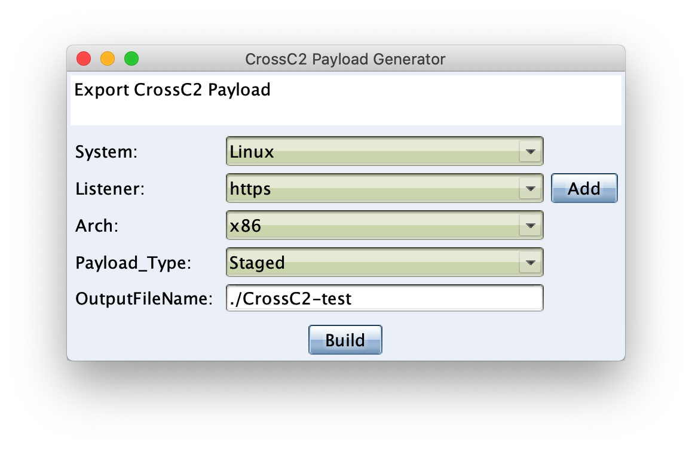

# Cross C2

[README](README.md) | [中文文档](README_zh.md)

# Cross C2 - Generator CobaltStrike's cross-platform beacon

```
     ▄████▄   ██▀███   ▒█████    ██████   ██████     ▄████▄   ██████▄ 
    ▒██▀ ▀█  ▓██ ▒ ██▒▒██▒  ██▒▒██    ▒ ▒██    ▒    ▒██▀ ▀█        ██░
    ▒▓█    ▄ ▓██ ░▄█ ▒▒██░  ██▒░ ▓██▄   ░ ▓██▄      ▒▓█        █████▒ 
    ▒▓▓▄ ▄██▒▒██▀▀█▄  ▒██   ██░  ▒   ██▒  ▒   ██▒   ▒▓▓▄ ▄█ ░▒██      
    ▒ ▓███▀ ░░██▓ ▒██▒░ ████▓▒░▒██████▒▒▒██████▒▒   ▒ ▓███▀  ░▒▓█████▓
    ░ ░▒ ▒  ░░ ▒▓ ░▒▓░░ ▒░▒░▒░ ▒ ▒▓▒ ▒ ░▒ ▒▓▒ ▒ ░   ░ ░▒ ▒    ░▒ ░▓ ░░
      ░  ▒     ░▒ ░ ▒░  ░ ▒ ▒░ ░ ░▒  ░ ░░ ░▒  ░ ░     ░  ▒     ░ ░░ ░ 
    ░          ░░   ░ ░ ░ ░ ▒  ░  ░  ░  ░  ░  ░     ░         by:░hook
    ░ ░         ░         ░ ░        ░        ░     ░ ░          ░    
    ░                                               ░                 
              
```


# Description

Add beacon generation functions for CobaltStrike's cross-platform beacon. Currently only supported on **Linux** & **MacOS**.


|  | Windows | Linux | MacOS | iOS | Android | Embedded |
| --- | --- | --- | --- | --- | --- | --- |
| Run Env (x86) |  | √ |  |  |  |  |
| Run Env (x64) |  | √ | √ |  |  |  |
| gen beacon (x86) |  | √ |  |  |  |  |
| gen beacon (x64) |  | √ | √ |  |  |  |
| gen beacon (armv7) |  |  |  | ⍻ | ⍻ |  |
| gen beacon (arm64) |  |  |  | ⍻ | ⍻ |  |
| gen beacon (mips[el]) |  |  |  |  |  | ⍻ |

Restricted description:
* MacOS: Latest systems only support 64-bit programs
* iOS: sandbox, restricted cmd
* Embedded: only *nix
* ⍻ : Loader is still in progress


# Install

Download:

> 
* **CrossC2.cna**
* **genCrossC2** `CS Env`

1. copy **CrossC2.cna** and **genCrossC2** file to `CobaltStrike`'s **rootdir**  (Must be in the **same directory** )
2. choose `Script Manager`，add `CrossC2.cna` (If successfully installed, the menu bar will have an additional item `CrossC2`)
3. Modify the `genCrossC2` path in the` CrossC2.cna` script to the **real path**

```
exec("/xxx/xxx/genCrossC2"... -> exec("/opt/cs/genCrossC2"...
```


# Usage

## teamserver

For some reasons, only HTTPS beacon is currently supported.
`C2Profile dynamic analysis will be supported in the future`

**Copy `.cobaltstrike.beacon_keys` from the cs directory on the server to the local cs directory.**

## cna plugin way

```
Menu bar: CrossC2 -> CrossC2 Payload Generator -> genCrossC2

Can be configured in the pop-up dialog:
1. Operating System
2. Arach
3. Payload Type(Currently only supports Stageless, Staged is being updated)
4. Generate file save path

```


## Run the underlying program directly

In addition to cna GUI generation, you can also directly call the underlying program to generate directly.

```
[usage]: genCrossC2 [host] [port] [getURI] [postURI] [platform] [arch] [outputFileName]


-platform		'MacOS' / 'Linux'
-arch    		'x86' / 'x64'

[ex]:
	genCrossC2 127.0.0.1 4444 null null MacOS x64 ./CrossC2-test
```


# Coming soon

1. Rich C2Profile support
2. Staged Type Shellcode Generation
3. http-proxy (auth) & socks proxy back connection support
4. Proxy-Pivots 
5. node beacon? (Single node type, can host other beacon without relying on teamserver)


# Examples


# Bug

1. File download is not supported.


# ChangeLog

## release v0.1 : 

* Support Linux & MacOS beacon generation.

md5(genCrossC2.Linux) = f4c0cc85c7cdd096d2b7febedc037538
md5(genCrossC2.MacOS) = 79fff0505092fc2055824ed1289ce8f9

## release v0.2 : 

* - fix genCrossC2.Linux crash.
* - fix uploading large file error.
* + support GUI file manager.

md5(genCrossC2.Linux) = 8256374d88c2149efc102aff7e90b3f9
md5(genCrossC2.MacOS) = 08fce0a5d964a091d8bf2344d7ab809e


