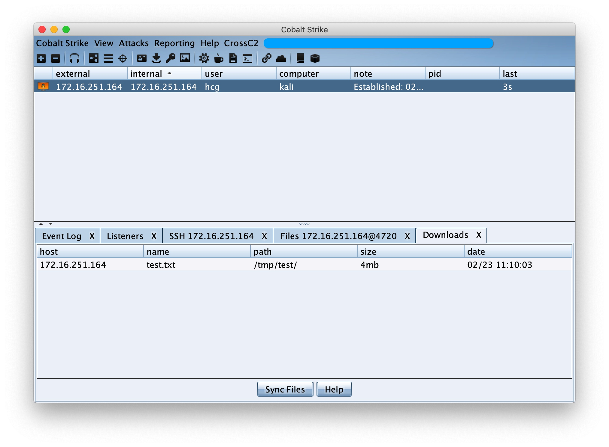

# Cross C2

[README](README.md) | [中文文档](README_zh.md)

🚀 更快捷的生成方式，参见 **cna** 介绍 [GO📌](#cna插件方式)

🎉 **Android** & **iPhone** 支持 [GO📌](#Mobile)

# Cross C2 - 生成CobaltStrike的跨平台beacon

```
     ▄████▄   ██▀███   ▒█████    ██████   ██████     ▄████▄   ██████▄ 
    ▒██▀ ▀█  ▓██ ▒ ██▒▒██▒  ██▒▒██    ▒ ▒██    ▒    ▒██▀ ▀█        ██░
    ▒▓█    ▄ ▓██ ░▄█ ▒▒██░  ██▒░ ▓██▄   ░ ▓██▄      ▒▓█        █████▒ 
    ▒▓▓▄ ▄██▒▒██▀▀█▄  ▒██   ██░  ▒   ██▒  ▒   ██▒   ▒▓▓▄ ▄█ ░▒██      
    ▒ ▓███▀ ░░██▓ ▒██▒░ ████▓▒░▒██████▒▒▒██████▒▒   ▒ ▓███▀  ░▒▓█████▓
    ░ ░▒ ▒  ░░ ▒▓ ░▒▓░░ ▒░▒░▒░ ▒ ▒▓▒ ▒ ░▒ ▒▓▒ ▒ ░   ░ ░▒ ▒    ░▒ ░▓ ░░
      ░  ▒     ░▒ ░ ▒░  ░ ▒ ▒░ ░ ░▒  ░ ░░ ░▒  ░ ░     ░  ▒     ░ ░░ ░ 
    ░          ░░   ░ ░ ░ ░ ▒  ░  ░  ░  ░  ░  ░     ░         by:░hook
    ░ ░         ░         ░ ░        ░        ░     ░ ░          ░    
    ░                                               ░                 
              
```


# Description

为CobaltStrike添加其他平台的beacon生成功能，暂时仅支持在 **Linux** & **MacOS** 上运行。


|  | Windows | Linux | MacOS | iOS | Android | Embedded |
| --- | --- | --- | --- | --- | --- | --- |
| Run Env (x86) |  | √ |  |  |  |  |
| Run Env (x64) |  | √ | √ |  |  |  |
| gen beacon (x86) |  | √ |  |  | √ |  |
| gen beacon (x64) |  | √ | √ |  |  |  |
| gen beacon (armv7) |  |  |  | ⍻  | √ |  |
| gen beacon (arm64) |  |  |  | √ | √ |  |
| gen beacon (mips[el]) |  |  |  |  |  | ⍻ |

受限说明:
* Linux: 特别老旧的系统可以选择cna中的"Linux-GLIBC"选项（2010年左右）
* MacOS: 新系统仅支持64位程序
* iOS: sandbox 
* Embedded: only *nix
* ⍻ : 加载还在完善中


# Install

下载基础文件:

> 
* **CrossC2.cna**
* **genCrossC2** `CS运行环境`

1. 拷贝 **CrossC2.cna** 与 **genCrossC2** 文件到CobaltStrike **根目录** 下 (必须处于 **同目录** )
2. 选择`Script Manager`，添加`CrossC2.cna` (如果成功安装，菜单栏会多出一项 `CrossC2`)
3. 修改`CrossC2.cna`脚本中`genCrossC2`路径为**真实路径**

```
|  | Windows | Linux | MacOS | iOS | Android | Embedded |
| --- | --- | --- | --- | --- | --- | --- |
| Run Env (x86) |  | √ |  |  |  |  |
| Run Env (x64) |  | √ | √ |  |  |  |
| gen beacon (x86) |  | √ |  |  | √ |  |
| gen beacon (x64) |  | √ | √ |  |  |  |
| gen beacon (armv7) |  |  |  |   | √ |  |
| gen beacon (arm64) |  |  |  | √ | √ |  |
| gen beacon (mips[el]) |  |  |  |  |  | ⍻ |

exec("/xxx/xxx/genCrossC2"... -> exec("/opt/cs/genCrossC2"...
```


# Usage

## teamserver

因为一些原因，目前强制只支持HTTPS beacon
`后续将支持C2~~Profile动态解析`

**复制server上cs目录下的 `.cobaltstrike.beacon_keys`到本地cs目录下**

## cna插件方式 

```
菜单栏: CrossC2 -> CrossC2 Payload Generator -> genCrossC2

弹出的对话框中可以配置:
1. 操作系统
2. 运行位数
3. Payload类型(目前仅支持Stageless, Staged正在更新中)
4. 生成文件保存路径

最终将生成Payload到指定目录以及创建供wget等工具使用的Scripted Web Delivery

```


## 直接运行底层程序

除过cna GUI生成外，也可以直接调用底层程序直接生成。

```
[usage]: genCrossC2 [host] [port] [getURI] [postURI] [platform] [arch] [outputFileName]


-platform		'MacOS' / 'Linux'
-arch    		'x86' / 'x64'

[ex]:
	genCrossC2 127.0.0.1 4444 null null MacOS x64 ./CrossC2-test
```


# 即将上线

1. 丰富的C2Profile支持
2. Staged类型Shellcode生成
3. http-proxy (auth) & socks 代理回连支持
4. 流量中转支持 
5. node beacon? (单个节点式，可进行不依靠teamserver托管其他beacon)

# Examples

## Mobile


## MacOS & Linux





# ChangeLog

## release v0.1 : 

* 支持 生成 Linux & MacOS beacon.

md5(genCrossC2.Linux) = f4c0cc85c7cdd096d2b7febedc037538

md5(genCrossC2.MacOS) = 79fff0505092fc2055824ed1289ce8f9

## release v0.2 : 

* -修复 Linux genCrossC2.Linux 崩溃的bug.
* -修复 大文件上传时末尾字节写入不全的bug.
* +支持 GUI的文件管理器.

md5(genCrossC2.Linux) = 8256374d88c2149efc102aff7e90b3f9

md5(genCrossC2.MacOS) = 08fce0a5d964a091d8bf2344d7ab809e

## release v0.3 :

* +支持 老系统Linux上低版本GLIBC的兼容 (2010年左右)

## release v0.4 :

* -变更 shell命令执行时采用后台多线程方式
* -变更 shell命令执行时错误输出重定向到标准输出
* +支持 增加后台文件下载功能

md5(genCrossC2.Linux) = b2e34f721ec2543b6625e33c8c2935df

md5(genCrossC2.MacOS) = 4e38a9d9a3eeff309648afc02e2e7664


